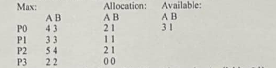

### Câu 1: Tại sao mỗi luồng cần có các thanh ghi riêng?
- **A.** Để tăng kích thước bộ nhớ
- **B.** Để giảm hiệu suất
- **C.** Để lưu trữ trạng thái thực thi riêng của mỗi luồng
- **D.** Để tăng độ phức tạp

>

### Câu 2: Trong quản lý thiết bị vào/ ra, hệ điều hành đảm nhiệm việc:
- **A.** Không liên quan đến thiết bị vào ra
- **B.** Chỉ điều khiển thiết bị
- **C.** Điều khiển thiết bị và quản lý các truy cập
- **D.** Chỉ cấp phát thiết bị

>

### Câu 3: Trong cấu trúc vi nhân (Micro-Kernel), cơ chế truyền thông điệp (message passing) có vai trò gì?
- **A.** Chỉ dùng trong mạng
- **B.** Giao tiếp giữa các dịch vụ khác nhau
- **C.** Không có vai trò quan trọng
- **D.** Chỉ để gửi dữ liệu

>

### Câu 4: Trong cấu trúc phân lớp, tính chất quan trọng nào cần được đảm bảo?
- **A.** Lớp trên chỉ được sử dụng dịch vụ của lớp dưới
- **B.** Các lớp hoạt động độc lập hoàn toàn
- **C.** Không có sự phụ thuộc giữa các lớp
- **D.** Mỗi lớp có thể truy cập các lớp khác

>

### Câu 5: Tiến trình (process) là gì?
- **A.** Chương trình đang thực hiện
- **B.** Cả 3 đều sai
- **C.** Chương trình lưu trong đĩa
- **D.** Chương trình

>

### Câu 6: Đâu là đặc điểm của hệ điều hành thời gian thực?
- **A.** Chỉ thực hiện một tác vụ tại một thời điểm
- **B.** Không có khả năng xử lý ngắt
- **C.** Đảm bảo thời gian đáp ứng chính xác cho các dịch vụ
- **D.** Không quan tâm đến thời gian đáp ứng

>

### Câu 7: Quan điểm hệ thống đánh giá hệ điều hành dựa trên yếu tố nào?
- **A.** Khả năng chơi game
- **B.** Hiệu suất và độ tin cậy của toàn hệ thống
- **C.** Tính thẩm mỹ của giao diện
- **D.** Số lượng ứng dụng hỗ trợ

>

### Câu 8: Theo quan điểm của người sử dụng thông thường, yêu cầu quan trọng nhất đối với hệ điều hành là gì?
- **A.** Dễ sử dụng và giao diện thân thiện
- **B.** Khả năng bảo mật cao
- **C.** Quản lý tài nguyên hiệu quả
- **D.** Hiệu suất cao và tối ưu tài nguyên

>

### Câu 9: Trong hệ thống tính toán, bộ nhớ chính có vai trò gì?
- **A.** Chỉ lưu trữ chương trình
- **B.** Chỉ lưu trữ dữ liệu
- **C.** Chương trình quản lý bộ nhớ tự do
- **D.** Là nơi lưu trữ tạm thời dữ liệu và chương trình

>

### Câu 10: Khi nhiều máy ảo cùng hoạt động trên một máy tính vật lý, hệ điều hành đảm bao điều gì?
- **A.** Các máy ảo hoạt động độc lập và không ảnh hưởng lẫn nhau
- **B.** Các máy ảo phải dùng chung tài nguyên
- **C.** Chỉ một máy ảo được hoạt động tại một thời điểm
- **D.** Các máy ảo can thiệp lẫn nhau

>

### Câu 11: Trong đồ thị cấp phát tài nguyên, chu trình có ý nghĩa gì?
- **A.** Hệ thống hoạt động tốt
- **B.** Hệ thống luôn hoạt động
- **C.** Không liên quan đến deadlock
- **D.** Có thể có deadlock

>

### Câu 12: PCB chứa những loại thông tin nào về trạng thái CPU?
- **A.** Chỉ có Program Counter
- **B.** Program Counter và nội dung các thanh ghi
- **C.** Không chứa thông tin về CPU
- **D.** Chỉ có trạng thái tiến trình

>

### Câu 13: Truyền thông non-blocking thích hợp trong trường hợp nào?
- **A.** Cần đảm bảo thông điệp được nhận lập tức
- **B.** Khi thông điệp không quan trọng
- **C.** Khi cần đồng bộ chặt chẽ
- **D.** Khi hệ thống yêu cầu độ trễ thấp và hiệu suất cao

>

### Câu 14: Trong môi hình đa xử lý không đối xứng, đặc điểm chính là:
- **A.** Tất cả CPU đều như nhau
- **B.** Không có CPU nào điều khiển
- **C.** Các CPU hoạt động đôc lập hoàn toàn
- **D.** Một CPU chủ điều khiển hệ thống, các CPU khác thực hiện theo chỉ thị

>

### Câu 15: Trong hệ thống thời gian thực, nên sử dụng kiểu truyền thông nào?
- **A.** Không sử dụng truyền thông điệp
- **B.** Chỉ dùng blocking
- **C.** Chỉ dùng non-blocking
- **D.** Tùy theo yêu cầu về thời gian và độ tin cậy

>

### Câu 16: Khả năng chứa của message queue có thể là
- **A.** Unbounded capacity
- **B.** Tất cả các đáp án trên
- **C.** Zero capacity
- **D.** Bounded capacity

>

### Câu 17: Trong Window, thread được quản lý ở đâu?
- **A.** Không có thread
- **B.** Cả kernel và user level
- **C.** Chỉ ở user level
- **D.** Chỉ ở kernel level

>

### Câu 18: Linker (trình biên tập) có nhiệm vụ gì?
- **A.** Biên dịch ... nguồn
- **B.** Kết nối các module đối tượng và thư viện
- **C.** Thực thi chương trình
- **D.** Debug chương trình

>

### Câu 19: User-level threads được quản lý bởi thành phần nào?
- **A.** Thread library in user space
- **B.** Kernel
- **C.** Device driver
- **D.** Hardware

>

### Câu 20: Cho mã giả của bài toán Dining Philosophers:
do
{
    P(chopstick[i]);
    P(chopstick[(i+1)%5]);
    //eat
    V(chopstick[i]);
    V(chopstick[(i+1)%5]);
    //think
}
while(true);
Vấn đề có thể xảy ra với mã này là:
- **A.** Không có vấn đề gì
- **B.** Chỉ một triết gia được ăn
- **C.** Deadlock khi tất cả triết gia cầm đũa trái
- **D.** Không có triết gia  nào có thể ăn

>

### Câu 21: Đa xử lý đối xứng là gì?
- **A.** Chỉ một CPU hoạt động
- **B.** Tất cả CPU đều ngang hàng và thực hiện mọi việc như nhau
- **C.** Các CPU không liên quan đến nhau
- **D.** Mỗi CPU chỉ thực hiện một nhiệm vụ riêng

>

### Câu 22: Đặc điểm của hai tiến trình có quan hệ hợp tác là gì?
- **A.** Luôn cạnh tranh tài nguyên
- **B.** Hoàn toàn độc lập
- **C.** Chia sẻ dữ liệu và thông tin với nhau
- **D.** Không trao đổi thông tin

>

### Câu 23: Windows sử dụng cơ chế nào để tạo tiến trình mới?
- **A.** Copy toàn bộ tiến trình cha
- **B.** Khôn có cơ chế tạo tiến trình
- **C.** Fork() như Unix
- **D.** CreateProcess() tạo tiến trình mới hoàn toàn

>

### Câu 24: Tiến trình khác với chương trình ở đặc điểm nào sau đây?
- **A.** Có PC và trạng thái tiến trình
- **B.** Được lưu trên đĩa cứng
- **C.** Có mã nguồn
- **D.** Có thể sao chép

>
### Câu 25: Trong quá trình chuyển đổi ngữ cảnh, thông tin nào được lưu trữ
- **A.** Chỉ có địa chỉ bộ nhớ
- **B.** Chỉ có PC 
- **C.** Chỉ có giá trị các thanh ghi
- **D.** PC, giá trị các thanh ghi và thông tin về trạng thái tiến trình

>

### Câu 26: Giải thuật Banker yêu cầu biết trước thông tin nào?
- **A.** Thời gian chạy của tiến trình
- **B.** Chỉ số tiến trình đang chạy
- **C.** Thứ tự thực hiện các chương trình
- **D.** Số lượng tối đa tài nguyên mỗi tiến trình yêu cầu

>

### Câu 27: Trong tiến trình đa luồng, các luồng chia sẻ những gì?
- **A.** Chia sẻ mã nguồn, dữ liệu và tài nguyên tiến trình
- **B.** Không chia sẻ gì cả
- **C.** Chỉ chia sẻ dữ liệu
- **D.** Chỉ chia sẻ mã nguồn

>

### Câu 28: Device queues được tổ chức như thế nào?
- **A.** Một hàng đợi chung cho tất cả thiết bị
- **B.** Chỉ một hàng đợi cho thiết bị vào
- **C.** Chỉ một hàng đợi cho thiết bị ra
- **D.** Một hàng đợi riêng cho thiết bị I/O

>

### Câu 29: Khi một tiến trình yêu cầu I/O, nó sẽ được chuyển từ đâu đến đâu?
- **A.** Từ device queue đến job queue
- **B.** Từ ready queue đến job queue
- **C.** Từ ready queue đến device queue tương ứng
- **D.** Từ job queue đến ready queue

>

### Câu 30: Phát hiện deadlock thường được thực hiện:
- **A.** Không bao giờ
- **B.** Định kỳ
- **C.** Chỉ khi khởi động hệ thống
- **D.** Liên tục

>

### Câu 31: Stack của luồng dùng để làm gì?
- **A.** Chứa tất cả dữ liệu của tiến trình
- **B.** Chứa biến toàn cục
- **C.** Chứa mã nguồn
- **D.** Chứa biến cục bộ và thông tin truyền tham số

>

### Câu 32: Chuyển đổi ngữ cảnh xảy ra khi nào?
- **A.** Chỉ khi khởi động máy
- **B.** Chỉ khi tạo tiến trình mới
- **C.** Chỉ khi tiến trình kết thúc
- **D.** Khi hết time lượng tử (quantum) hoặc xuất hiện interrupt

>

### Câu 33: Kernel-level threads có ưu điểm gì so với user-level threads
- **A.** Tốc độ chuyển đổi nhanh hơn
- **B.** Có thể tận dụng được hệ thống đa xử lý
- **C.** Dễ lập trình hơn
- **D.** Không tốn tài nguyên hệ thống

>

### Câu 34: Khi một tiến trình đang thực thi và cần chờ I/O, nó sẽ chuyển sang trạng thái nào?
- **A.** New
- **B.** Terminated
- **C.** Wait/Blocked
- **D.** Ready

>

### Câu 35: Khi một luồng bị block trong tiến trình đa luồng
- **A.** Toàn bộ tiến trình bị block
- **B.** Tất cả các luồng đều phải dừng lại
- **C.** Chỉ luồng đó bị block, các luồng khác vẫn chạy
- **D.** Tiến trình sẽ tự động kết thúc

>

### Câu 36: Theo lý thuyết, tiến trình tồn tại ở mấy trạng thái
- **A.** 6
- **B.** 4
- **C.** 5
- **D.** 7

>

### Câu 37: Lập lịch cho luồng được thực hiện ở đâu
- **A.** Chỉ ở mức kernel
- **B.** Có thể ở cả mức user và kernel
- **C.** Không cần lập lịch
- **D.** Chỉ ở mức user

>

### Câu 38: Ưu điểm của mô hình đa xử lý đối xứng là
- **A.** Tăng khả năng chịu lỗi và cân bằng tốt
- **B.** Dễ lập trình hơn
- **C.** Tốn ít tài nguyên
- **D.** Không cần đồng bộ hóa

>

### Câu 39: Trong UNIX, quan hệ giữa tiến trình cha và con như thế nào?
- **A.** Chia sẻ tất cả tài nguyên
- **B.** Hoàn toàn độc lập
- **C.** Chia sẻ code segment nhưng có data segment riêng
- **D.** Không có mối quan hệ

>

### Câu 40: Hai tiến trình có quan hệ cạnh tranh khi nào?
- **A.** Khi không dùng tài nguyên
- **B.** Khi hợp tác với nhau
- **C.** Khi tranh chấp tài nguyên chung
- **D.** Khi hoàn toàn độc lập

>

### Câu 41: Cho hệ thống với 5 tiến trình P0 đến P4 và 3 loại tài nguyên ABC

Nếu P1 yêu cầu thêm (1,0,2), yêu cầu có được chấp nhận không?
- **A.** Chấp nhận
- **B.** Cần thêm thông tin
- **C.** Không thể xác định
- **D.** Từ chối

>

### Hệ thống có ở trạng thái an toàn không?
- **A.** Không thể xác định
- **B.** An toàn
- **C.** Không an toàn
- **D.** Cần thêm thông tin

>

### Câu 42: Cho hệ thống với 3 tiến trình: P1, P2, P3 và 2 loại tài nguyên R1 (2 instances), R2(3 instances). Trạng thái hiện tại: P1 đang giữ 1 R1, yêu cầu 1 R2; P2 đang giữ 1 R2, yêu cầu 1 R1; P3 đang giữ 1 R1, 1 R2. Vẽ đồ thị cấp phát tài nguyên có deadlock không?
- **A.** Không
- **B.** Cần thêm thông tin
- **C.** Có
- **D.** Không thể xác định

>

### Câu 43: Thuật toán Round Robin với quantum = 4: Cho 3 tiến trình với thời gian hoạt động: P1: 24ms, P2: 3ms, P3: 3ms. Tính thời gian hoàn thành của P1?
- **A.** 28
- **B.** 30
- **C.** 24
- **D.** 32

>

### Câu 44: Điều độ SRT (Shortest remaining time): Cho các tiến trình với thời điểm xuất hiện và thời gian hoạt động như sau: P1: xuất hiện bằng 0, hoạt động bằng 8; P1: xuất hiện bằng 1, hoạt động bằng 4; P1: xuất hiện bằng 2, hoạt động bằng 2. Thời điểm P1 hoàn thành là:
- **A.** 8
- **B.** 14
- **C.** 12
- **D.** 16

>