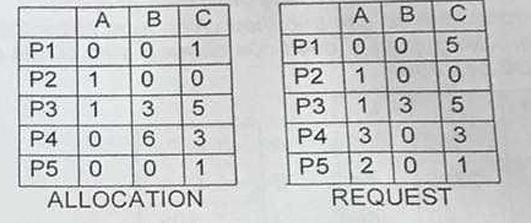
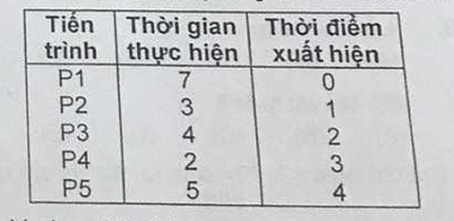
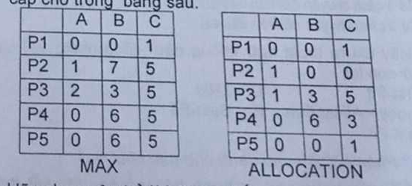

### Câu 1: Quan điểm: "Hệ điều hành là hệ thống chương trình nhằm tạo ra một máy ảo trên một máy vật lý" là của:
- **A.** Người dùng
- **B.** Quản lý
- **C.** Tất cả các khái niệm trên
- **D.** Hệ thống
- **E.** Kỹ thuật

Góc nhìn của người sử dụng: Hệ điều hành là hệ thống chương trình phục vụ khai thác hệ thống tính toán một cách thuận lợi.

Góc nhìn của người quản lý: Hệ điều hành là hệ thống chương trình phục vụ quản lý chặt chẽ và sử dụng tối ưu các tài nguyên của hệ thống tính toán.

Quan điểm kỹ thuật: Hệ điều hành là một hệ thống chương trình trang bị cho một máy tính cụ thể để tạo ra một máy tính logic mới với tài nguyên mới và khả năng mới.

Quan điểm hệ thống: Hệ điều hành là một hệ thống mô hình hoá, mô phỏng hoạt động của máy tính, của người sử dụng và của các thao tác viên, hoạt động trong chế độ đối thoại nhằm tạo môi trường khai thác thuận lợi hệ thống máy tính và quản lý tối ưu tài nguyên của hệ thống.

> Đáp án đúng là E

### Câu 2: Giải thuật điều phối Processors không độc quyền và ưu tiên tiến trình ngắn là:
- **A.** RR
- **B.** SJN
- **C.** SJF
- **D.** FCFS
- **E.** SRTF

Round Robin là giải thuật không độc quyền, tuy nhiên nó cũng không quan tâm tiến trình ngắn hay dài

Shortest Job Next và Shortest Job First giống nhau là giải thuật độc quyền (Hệ điều hành không được cướp CPU), nó cứ thấy tiến trình nào ngắn nhất trong hàng chờ thì nó lấy

FCFS là giải thuật độc quyền và nó cũng không quan tâm tiến trình dài hay ngắn

Shortest Remaining Time First, đây là giải thuật không độc quyền, hệ điều hành cứ thấy tiến trình nào ngắn nhất thì nó lấy, không quan tâm tiến trình hiện tại chạy được như nào rồi.

> Đáp án đúng: E

### Câu 3: Chọn phát biểu không chính xác về đồ thị chờ dợi
- **A.** Thu được đồ thị cung cấp tài nguyên
- **B.** Các cung trên đồ thị biểu diễn mối quan hệ chờ đợi giữa các tiến trình trong hệ thống
- **C.** Trên đồ thị có chu trình, hệ thống có bế tắc
- **D.** Không tồn tại các đỉnh kiểu tài nguyên
- **E.** Chỉ sử dụng hiệu quả khi các tài nguyên chỉ có đúng một đơn vị
 
 Đồ thị chờ đợi được tạo ra từ đồ thị cung cấp tài nguyên, loại bỏ các đỉnh kiểu tài nguyên, chỉ giữ lại mối quan hệ chờ đợi giữa các tiến trình, đồ thị này chỉ sử dụng hiệu quả khi các tài nguyên chỉ có một đơn vị, và nếu là như thế thì khi có chu trình thì hệ thống chắc chắn sẽ có bế tắc.

> Đáp án đúng: A

### Câu 4: Với 3 trạng thái của tiến trình: Sẵn sàng thực hiện và chờ đợi. Các chuyển đổi có thể xảy ra là:
- **A.** Sẵn sàng -> Thực hiện; Chờ đợi -> Thực hiện
- **B.** Thực hiện -> Sẵn sàng; Chờ đợi -> Sẵn sàng
- **C.** Thực hiện -> Chờ đợi; Sẵn sàng -> Chờ đợi
- **D.** Cả 3 cách chuyển đổi trên đều được
- **E.** Cả 3 cách chuyển đổi trên đều sai

Đáp án B đúng vì đây là trường hợp trưng dụng CPU

> Đáp án đúng: B

### Câu 5: Hãy chỉ ra thuật ngữ không nằm cùng nhóm với các thuật ngữ còn lại
- **A.** First-Fit
- **B.** Buddy - Allocation
- **C.** Next- Fit
- **D.** LRU
- **E.** Best-Fit

•  Tại sao A, B, C, E cùng một phe? (Nhóm Tìm ghế trống)
•	Các thuật ngữ First-Fit, Next-Fit, Best-Fit và Buddy-Allocation đều thuộc họ Thuật toán cấp phát bộ nhớ (Memory Allocation Algorithms).
•	Nhiệm vụ cốt lõi của chúng: Khi một tiến trình mới sinh ra, hệ điều hành sẽ dùng các thuật toán này để rà quét vùng nhớ (RAM), tìm kiếm một khoảng trống văng vẳng (Hole) vừa vặn nhất để "nhét" tiến trình đó vào.
•  Tại sao D lại lạc loài? (Nhóm Mời khách ra ngoài)
•	LRU (Least Recently Used - Ít được sử dụng nhất trong thời gian gần đây) thuộc họ Thuật toán thay thế trang (Page Replacement Algorithms), nằm tít bên chương Bộ nhớ ảo (Virtual Memory).
•	Nhiệm vụ của LRU lại nằm ở đầu ngược lại: Khi RAM đã chật cứng đến mức không còn chỗ trống, LRU phải đóng vai "bảo kê", đi tìm xem trang nhớ (Page) nào đã "mọc rễ" quá lâu mà không có ai thèm dùng đến, để tiến hành "đá" nó ra khỏi RAM (đẩy xuống ổ cứng). Việc này giúp dọn chỗ cho dữ liệu mới đi vào.

> Đáp án đúng: D

### Hãy cho biết các trang còn lại trong bộ nhớ sau khi kết thúc dãy truy nhập sau: 1,2,3,4,2,5,4,1,3,5,3,2,3,2; nếu hệ thống có 3 trang vật lý và sử dụng: *Cuối kỳ*

## Câu 6: Thuật toán đổi trang FIFO:
- **A.** 1,2,5
- **B.** 1,3,5
- **C.** Không có câu trả lời nào đúng
- **D.** 2,3,5
- **E.** 1,2,3

>

## Câu 7: Thuật toán đổi trang LRU: *Cuối kỳ*
- **A.** 1,3,4
- **B.** 2,4,5
- **C.** Không có câu trả lời nào đúng
- **D.** 2,3,5
- **E.** 1,3,5

>

## Câu 8: Phát biểu nào dưới đây là đúng về bộ điều phối CPU
- **A.** Yêu cầu tốc độ thực hành nhanh
- **B.** Lựa chọn tiến trình trong Job Queue
- **C.** Được thực hiện không thường xuyên
- **D.** Quyết định số tiến trình tồn tại đồng thời trong bộ nhớ
- **E.** Tất cả các phát biểu trên đều sai

A là tính chất của bộ điều phối CPU, đối với đáp án B, bộ điều phối CV chọn tiến trình trong Job Queue còn bộ điều phối CPU chọn luồng trong RAM, đối với đáp án C, bộ điều phối CV thực hiện không thường xuyên, còn bộ điều phối CPU thì gần như là liên tục. Đáp án D: Bộ điều phối công việc sẽ quyết định tiến trình nào trong ổ cứng được tồn tại trong bộ nhớ

> Đáp án đúng: A

### Câu 9: "Tăng kích thước của bộ nhớ vật lý không làm thay đổi hiệu quả sử dụng chương trình" là đặc điểm của cấu trúc chương trình nào dưới đây? *Cuối kỳ*
- **A.** Cấu trúc nạp động
- **B.** Cấu trúc Overlay
- **C.** Cấu trúc liên kết động
- **D.** Cấu trúc phân đoạn
- **E.** Cấu trúc phân trang

>

### Câu 10: Hệ thống có 3 tiến trình dùng chung một tài nguyên găng. Nhu cầu tài nguyên lớn nhất của mỗi tiến trình lần lượt là 4,3,5 đơn vị. Lượng đơn vị tài nguyên nhỏ nhất để hệ thống không bao giờ rơi vào trạng thái bế tắc trong mọi chế độ hoạt động là:
- **A.** 5
- **B.** 8
- **C.** 10
- **D.** 12
- Không đáp án nào đúng

Ta tính trường hợp xấu nhất khiến xảy ra tình trạng bế tắc, đó chính là tất cả tiến trình đều chỉ còn thiếu đúng 1 đơn vị nữa để hoàn thành việc: (4-1) + (3-1) + (5-1) = 9. Nếu có 9 đơn vị, trường hợp xấu nhất sẽ như trên, 3 tiến trình sẽ cứ đợi nhau nhưng mà không còn đơn vị nào. Lúc này nếu thả thêm 1 đơn vị, sẽ có 1 tiến trình bất kỳ xong => Trả lại tài nguyên cho các tiến trình khác => hết bế tắc. Như vậy lượng tài nguyên nhỏ nhất cần thiết là: 9 + 1 = 10.

> Đáp án đúng: 10

### Câu 11: Hệ thống gồm 5 tiến trình, 3 tài nguyên với số lượng lần lượt là (3,9,12). Trạng thái cung cấp tài nguyên và yêu cầu tài nguyên của từng tiến trình được cho trong bảng sau:

Hãy chọn các câu trả lời đúng
- **A.** Hệ thống bế tắc với các tiến trình P2,P3,P4
- **B.** P1,P4,P5
- **C.** P1,P3,P4
- **D.** P2,P3,P5
Chương trình không bị bế tắc

Số lượng tài nguyên còn lại là: (1,0,2), scan từ trên xuống thì có P2 đủ điều kiện (1,0,0) => P2 được cấp tài nguyên, P2 trả lại tài nguyên =>(2,0,2). Tiếp tục scan thì có P5 đủ điều kiện => P5 được cấp tài nguyên, P5 trả lại tài nguyên => (2,0,3). Tiếp tục scan từ trên xuống thì không có tiến trình nào đủ tài nguyên => Hệ thống bế tắc với tiến trình P1,P3,P4

> Đáp án đúng: C

### Giả sử có 5 tiến trình đang trong trạng thái sẵn sàng thực hiện với các tham số như sau (thời gian tính theo đơn vị ms)

### Câu 12: Thời gian chờ đợi trung bình khi áp dụng thuật toán điều độ FCFS là:
- **A.** 7,4
- **B.** 8,4
- **C.** 9,0
- **D.** 9,4

Công thức bản chất: Thời gian chờ = Thời điểm bắt đầu được chạy - Thời điểm xuất hiện.
- P1 xuất hiện lúc 0, bắt đầu chạy lúc 0 => Thời gian chờ của P1 là: 0. Vì thời điểm P1 chạy xong là 7 trong khi thời gian xuất hiện muộn nhất là của P5, tức 4 => Khi P1 chạy xong thì có hàng đợi là [P2,P3,P4,P5]
- P2 xuất hiện lúc 1, bắt đầu chạy lúc P1 chạy xong, tức lúc 7 => Thời gian chờ của P2 là: 7-1=6
- P3 xuất hiện lúc 2, bắt đầu chạy lúc P2 chạy xong, tức lúc 7+3-10=> Thời gian chờ của P3 là: 10-2=8
- P4 xuất hiện lúc 3, bắt đầu chạy lúc P3 chạy xong, tức lúc 10+4=14=> Thời gian chờ của P4 là: 14-3=11
- P5 xuất hiện lúc 4, bắt đầu chạy lúc P4 chạy xong, tức lúc 14+2=16=> Thời gian chờ là: 16-4=12

Tổng kết thời gian chờ trung bình là: (0+6+8+11+12)/5=7.4

> Đáp án đúng: A

### Câu 13: Thời gian chờ đợi trung bình khi áp dụng thuật toán điều độ FCFS là:
- **A.** 7,0
- **B.** 6,8
- **C.** 8,8
- **D.** 5,0
Không có đáp án nào đúng

Ta có: P4<P2<P3<P5<P1. SJF là giải thuật độc quyền.
Đầu tiên, tại thời điểm 0, P1 xuất hiện, SJF là độc quyền nên nó sẽ chạy đến hết, tức lúc 7. Thời gian chờ của P1 là: 0. Khi P1 chạy xong, tất cả các tiến trình khác đều đã vào hàng chờ, thứ tự như sau: [P4,P2,P3,P5].
- P4 xuất hiện lúc 3, thời gian chạy là khi P1 kết thúc, tức 7. Thời gian chờ của P4 là: 7-3=4
- P2 xuất hiện lúc 1, thời gian chạy là khi P4 kết thúc, tức 7+2=9. Thời gian chờ của P2 là: 9-1=8
- P3 xuất hiện lúc 2, thời gian chạy là khi P2 kết thúc, tức 9+3=12. Thời gian chờ của P3 là: 12-2=10
- P5 xuất hiện lúc 4, thời gian chạy là khi P3 kết thúc, tức 12+4=16. Thời gian chờ của P5 là: 16-4=12.

Vậy thời gian chờ đợi trung bình là: (0+4+8+10+12)/5=6.8

> Đáp án đúng là: B

### Câu 14: Chọn giải thích hợp lý nhất cho phát biểu: Tiến trình đa luồng nhanh hơn tiến trình đơn luồng.
- **A.** Luôn đúng. Do vậy trong trong các hệ điều hành tiên tiến mới luôn sử dụng mô hình này
- **B.** Đúng khi tiến trình thực hiện nhiều tính toán
- **C.** Đúng khi tiến trình thực hiện nhiều vào ra
- **D.** Sai do tiến trình đa luồng và đơn luồng có tốc độ thực hiện như nhau
- **E.** Luôn sai, do phải tốn thời gian chuyển đổi giữa các luồng trong tiến trình đa luồng

A và B sai là vì, thường thì ta sẽ xét CPU 1 nhân, và nếu CPU 1 nhân, khi tiến trình chỉ thực hiện duy nhất tính toán, thì giữa tiến trình đơn, CPU chạy một lèo từ trên xuống dưới, so với tiến trình đa luồng, CPU chia nhỏ thời gian để phục vụ nhiều luồng, và thời gian chuyển giữa các luồng bị dôi ra, dẫn đến việc thậm chí đa luồng còn chậm hơn đơn luồng. Và khi ấy thì D, E cũng sai (E ghi là luôn sai). C đúng là vì khi thực hiện nhiều vào ra, nếu luồng trong tiến trình đơn luồng gặp I/O thì luồng sẽ tự trao lại CPU và bước vào state Waiting, nhưng vì tiến trình chỉ là đơn luồng, CPU sẽ phải ngồi đợi (rất lâu). Ngược lại thì đa luồng, nếu 1 luồng gặp I/O, trả lại CPU và ngồi đợi thì CPU sẽ lại phục vụ tiếp các luồng khác => Nhanh hơn.

### Câu 15: Giải thuật điều độ nào được cho rằng không gây ra hiện tượng chờ đợi tích cực
- **A.** Kiểm tra và xác lập (Test and set)
- **B.** Kỹ thuật đèn báo (Semaphore)
- **C.** Phương pháp khóa trong
- **D.** Thuật toán kiểm tra và xác lập mở rộng
- **E.** Thuật toán Dekker

- Phương pháp khóa trong thì có nhược điểm là có thể xảy ra trường hợp có 2 tiến trình cùng mở được khóa 1 lúc để sử dụng tài nguyên găng đồng thời, và lỗi chờ đợi tích cực (do lặp lại vòng while)
- Thuật toán Dekker có cải thiện là lập trình viên tạo ra dòng lệnh return (1 hoặc 0 tùy LTV), thuật toán này chỉ phát huy tác dụng khi chỉ có 2 luồng, nó giống khóa trong nhưng được cái nếu 2 luồng cùng mở được khóa thì dựa trên return 1 hoặc 0 mà 1 trong 2 luồng sẽ phải nhường => giải quyết vấn đề, nhưng vấn đề chờ đợi tích cực vẫn còn.
- Test and set là phiên bản thuật toán Dekker nhưng mà được thiết kế bởi phần cứng, CPU cố định việc phát hiện khóa mở hay đóng và mở khóa ra sẽ bắt buộc phải thực hiện trong đúng 1 xung nhịp, dẫn đến việc sẽ luôn luôn chỉ có 1 luồng được sử dụng tài nguyên găng trong 1 thời điểm, nhưng vẫn mắc hàng chờ đợi tích cực (Ưu thế hơn Dekker ở điểm phù hợp cho nhiều hơn 2 tiến trình)
- Kỹ thuật Đèn báo thì cũng giống Test and Set, nhưng thay vì lặp lại vòng While thì tiến trình sẽ đi luôn vào trạng thái block/waiting trong lúc đợi, tránh phung phí CPU.

> Đáp án đúng: B

### Câu 16: Hãy chọn phát biểu hợp lý nhất. Lời gọi hệ thống trong hệ điều hành nhằm mục đích
- **A.** Khởi tạo, hủy bỏ và đồng bộ các tiến trình trong hệ thống
- **B.** Cấp phát, thu hồi bộ nhớ đã cấp
- **C.** Sử dụng các dịch vụ của hệ điều hành
- **D.** Quản lý tài nguyên trong hệ thống
- Không có đáp án nào đúng

Lệnh System Call xảy ra ở Luồng User khi nó muốn đụng chạm đến tài nguyên, có thể hiểu là gửi thông báo đến cho hệ điều hành để được sử dụng tài nguyên => Sử dụng dịch vụ của hệ điều hành

> Đáp án đúng: C

### Câu 17: Yêu cầu nào dưới đây thuộc về tính an toàn của hệ điều hành
- **A.** Thích nghi với thay đổi trong tương lai
- **B.** Nhiều mức khai thác với hiệu quả khác nhau
- **C.** Thiết bị chậm không ảnh hưởng đến hệ thống
- **D.** Hoạt động phải chính xác tuyệt đối
- **E.** Không bị truy cập bất hợp lệ

> Đáp án đúng: E

### Câu 22: Giải thuật Dekker điều độ tiến trình qua đoạn găng không đảm bảo điều kiện nào?
- **A.** Chỉ một tiến trình sử dụng tài nguyên tại một thời điểm
- **B.** Khi tài nguyên găng tự do, các tiến trình đều có thể sử dụng tài nguyên găng
- **C.** Không tiến trình nào phải đợi tài nguyên găng vô hạn
- **D.** Tiến trình không sử dụng processor khi tới lượt sử dụng tài nguyên găng
- **E.** Các tiến trình phải chờ đợi khi tài nguyên găng đang bị tiến trình khác sử dụng

Giải thuật Dekker gặp phải vấn đề chờ đợi tích cực, nó vẫn dùng đến CPU ngay cả khi đợi, do đó D sai

> Đáp án đúng: D

### Câu 25: Hệ điều hành cần phải có nhiều mức khai thác khác nhau với hiệu quả ứng với trình độ và kinh nghiệm của người dùng là tính chất
- **A.** An toàn
- **B.** Thuận tiện
- **C.** Tổng quát theo thời gian
- **D.** Hiệu quả
- **E.** Tin cậy cao

Đáp án đúng là thuận tiện, ở đây có nghĩa là người dùng ở mức nào cũng xài được, còn ý hiệu quả là dành cho khả năng tối ưu tài nguyên

> Đáp án đúng: B

### Câu 27: Mục đích chính của hệ điều hành trong giai đoạn phần cứng rẻ, nhân công đắt là:
- **A.** Giảm thời gian rảnh rỗi của Processor
- **B.** Tăng khả năng phòng chống tấn công từ bên ngoài
- **C.** Giảm thời gian chờ đợi của người dùng
- **D.** Tăng tốc độ hoạt động của các thiết bị vào ra
- **E.** Tiết kiệm năng lượng tiêu thụ

Phần cứng đắt => Tối ưu phần cứng
Phần cứng rẻ, Nhân công đắt => Tối ưu trải nghiệm người dùng

> Đáp án đúng: C

### Câu 28: Cho hệ thống gồm 5 tiến trình, 3 tài nguyên với số lượng (3,4,12). Nhu cầu cực đại và tài nguyên đã cấp cho trong bảng sau:

### Hãy chọn câu trả lời đúng nhất
- **A.** Hệ thống an toàn với dãy 1 2 3 4 5
- **B.** 1 3 5 2 4
- **C.** 1 5 2 3 4
- **D.** 5 3 1 4 2
Hệ thống không an toàn

Một hệ thống an toàn có thể có nhiều chuỗi an toàn khác nhau.