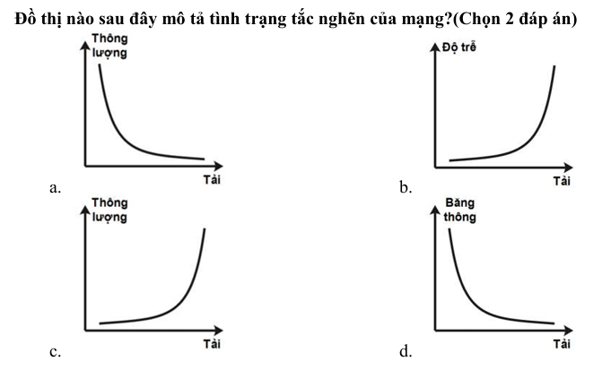
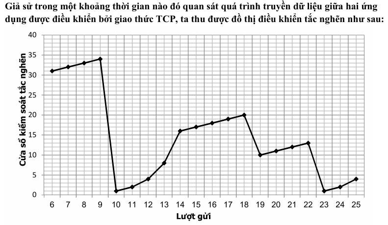
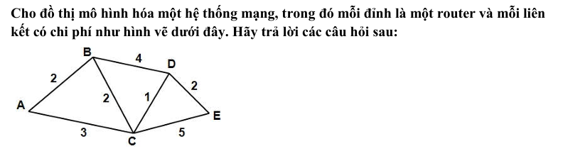

## **NGÂN HÀNG CÂU HỎI MẠNG MÁY TÍNH** 

## **Giá trị BER (Bit Error Rate = Tỷ lệ bít lỗi/Tỷ lệ bít truyền) phản ánh đặc trưng nào sau đây của đường truyền?** 

- a. Tốc độ truyền tin tối đa 

- b. Thông lượng 

- c. Độ tin cậy 

- d. Độ suy hao tín hiệu 

- e. Độ trễ 

## **Thông số RTT(Round Trip Time) trong quá trình truyền tin cho biết điều gì?** 

- a. Trễ hàng đợi trên các thiết bị chuyển tiếp 

- b. Thời gian chọn đường trên bộ định tuyến (router) 

- c. Trễ lan truyền tín hiệu trên đường truyền 

- d. Trễ 2 chiều giữa nút nguồn và nút đích 

## **Giả sử đường đi từ nút A đến nút B qua 3 liên kết với băng thông lần lượt là 4Mbps, 1Mbps và 2 Mbps. Thời gian để A truyền đến B một file có kích thước 10 MB là bao nhiêu. Giả sử các kết nối không truyền dữ liệu nào khác, trễ lan truyền và trễ tại các nút trung gian là không đáng kể?** 

- a. 80 s 

- b. 20 s 

- c. 40 s 

- d. 140 s 

- e. Xấp xỉ 11.4 s 

## **Đặc điểm của cơ chế truyền “best-effort” là gì?** 

- a. Chỉ gửi dữ liệu 1 lần, không phát lại 

- b. Thiết lập liên kết trước khi truyền 

- c. Sử dụng báo nhận 

## **Tại sao đường truyền phải có giá trị MTU(Maximum Transmission Unit) để giới hạn kích thước của gói tin được truyền?** 

- a. Giảm xác suất đụng độ 

- b. Giảm tỉ lệ lỗi bit (BER – Bit Error Rate) 

- c. Giảm xác suất phải truyền lại dữ liệu 

- d. Tăng tốc độ truyền tin 

## **Tại sao phải đặt giá trị MTU (Maximum Transmission Unit) cho đường truyền?** 

- a. Giảm tỉ lệ phải truyền lại do lỗi bit trên gói tin 

- b. Giảm trễ hàng đợi 

- c. Tăng hiệu suất sử dụng đường truyền 

- d. Tránh tắc nghẽn 

## **Thông số nào sau đây được sử dụng để đánh giá độ tin cậy của đường truyền? (Chọn 2 đáp án)** 

- a. Băng thông 

- b. Độ trễ 

- c. Độ suy hao 

- d. Tỉ lệ lỗi bit (BER) 

- e. Tỉ lệ mất gói tin 

## **Phát biểu nào sau đây là SAI về giao thức truyền thông?** 

- a. Quy định khuôn dạng dữ liệu khi truyền 

- b. Quy định cách thức xử lý dữ liệu ở mỗi bên 

- c. Quy định thứ tự các thông điệp khi truyền 

- d. Độc lập với các giao thức khác 

## **Mô  tả nào sau đây là đúng về kiến trúc phân tầng trong hệ thống truyền thông? (chọn 2 đáp án)** 

- a. Thứ tự các tầng có thể thay đổi linh hoạt khi triển khai 

- b. Tầng trên quyết định cách thức cung cấp dịch vụ của tầng dưới 

- c. Tầng dưới cung cấp dịch vụ cho tầng trên qua điểm truy cập dịch vụ (SAP) 

- d. Một số tầng không cần triển khai trên tất cả các nút mạng 

- e. Giao thức của mỗi tầng độc lập với nhau 

## **Trong kiến trúc phân tầng của hệ thống truyền thông, phát biểu nào sau đây là đúng? (Chọn 2 đáp án)** 

- a. Tại mỗi tầng, hai bên tham gia quá trình truyền tin phải sử dụng giao thức giống nhau 

- b. Quá trình đóng gói dữ liệu tại bên gửi được thực hiện từ tầng trên xuống tầng dưới 

- c. Mỗi mô hình phân tầng chọn một giao thức mạng để điều khiển hoạt động tất cả các tầng 

- d. Hoạt động của mỗi tầng không phụ thuộc vào các tầng khác 

## **Khái niệm PDU trong kiến trúc phân tầng là gì?** 

- a. Một giao thức truyền thông 

- b. Một tầng trong mô hình OSI 

- c. Đơn vị dữ liệu được đóng gói theo giao thức của mỗi tầng trong kiến trúc phân tầng 

- d. Điểm truy cập dịch vụ của mỗi tầng cung cấp cho tầng trên 

## **Trong kiến trúc phân tầng, khi nhận được dữ liệu từ tầng cao hơn chuyển xuống, tầng dưới xử lý như thế nào?** 

- a. Sửa thông tin phần tiêu đề 

- b. Loại bỏ phần tiêu đề của gói tin 

- c. Thêm tiêu đề cho gói tin 

- d. Thay thế tiêu đề của gói tin bằng tiêu đề mới 

## **Đóng gói dữ liệu(encapsuation) trong kiến trúc phân tầng được thực hiện như thế nào?** 

- a. Thêm phần tiêu đề mới vào gói tin nhận được ở tầng trên 

- b. Thay thế tiêu đề của gói tin tầng trên bằng tiêu đề mới 

- c. Nén phần dữ liệu trong gói tin nhận được từ tầng trên 

- d. Chỉ thực hiện thêm phần tiêu đề ở tầng dưới cùng 

## **Tính trong suốt trong kiến trúc phân tầng thể hiện như thế nào?** 

- a. Tầng trên sử dụng dịch vụ của tầng dưới qua điểm truy cập dịch vụ (SAP) mà không cần quan tâm cách thức tầng dưới thực hiện 

- b. Mỗi tầng cung cấp nhiều dịch vụ khác nhau 

- c. Dữ liệu được đóng gói theo giao thức điều khiển 

- d. Chức năng trên mỗi tầng là khác nhau 

- e. Hai tầng trên liên kết phải sử dụng giao thức giống nhau 

## **Trong mô hình TCP/IP, tầng nào thực hiện chức năng điều khiển truyền dữ liệu trên liên kết vật lý?** 

- a. Tầng vật lý 

- b. Tầng liên kết dữ liệu 

- c. Tầng mạng 

- d. Tầng giao vận 

## **Trong quá trình truyền dữ liệu, chức năng của tầng nào trong mô hình TCP/IP chỉ thực hiện trên các hệ thống đầu cuối? (chọn 2 đáp án)** 

- a.Tầng ứng dụng 

- b. Tầng giao vận 

- c. Tầng mạng 

- d. Tầng liên kết dữ liệu 

- e. Tầng vật lý 

## **Tầng ứng dụng của mô hình TCP/IP đảm nhận chức năng những tầng nào khi tham chiếu tới mô hình OSI?** 

- a. Tầng dụng, tầng phiên 

- b. Tầng ứng dụng, tầng trình diễn 

- c. Tầng ứng dụng, tầng phiên, tầng trình diễn 

- d. Tầng ứng dụng, tầng giao vận, tầng mạng 

- e. Tầng ứng dụng, tầng giao vận, tầng mạng 

## **Chức năng của tầng nào dưới đây chỉ thực hiện trên các nút mạng đầu cuối?** 

- a. Tầng giao vận 

- b. Tầng mạng 

- c. Tầng liên kết dữ liệu 

- d. Tầng vật lý 

## **Phát biểu nào sau đây là SAI?** 

- a. Mạng chuyển mạch kênh cung cấp dịch vụ theo mô hình hướng kết nối (connection-oriented) 

- b. Trong mạng chuyển mạch gói, dữ liệu của các liên kết khác nhau được truyền trên cùng một đường truyền vật lý 

- c. Chuyển tiếp dữ liệu trên mạng chuyển mạch kênh chậm hơn trên mạng chuyển mạch gói 

- d. Khi chuyển tiếp dữ liệu trong mạng chuyển mạch gói, có thể thiết lập độ ưu tiên cho các gói tin khi xử lý hàng đợi 

- e. Trong chuyển mạch kênh, tài nguyên của mỗi cuộc hội thoại được xác định trong giai đoạn thiết lập kênh và không đổi trong suốt quá trình truyền dữ liệu 

## **Phát biểu nào sau đây là đúng về chuyển mạch kênh?** 

- a. Tài nguyên của mỗi kênh là như nhau với mọi liên kết, không phụ thuộc vào yêu cầu chất lượng dịch vụ. 

- b. Trong mạng chuyển mạch kênh, do trước khi truyền dữ liệu, kênh truyền đã được thiết lập nên các giao thức tầng trên luôn là giao thức hướng không kết nối (connectionless). 

- c. Tài nguyên của mỗi kênh được xác định trong giai đoạn thiết lập kênh và không đổi trong suốt 

   - quá trình truyền dữ liệu. 

- d. Để tăng độ tin cậy khi truyền tải dữ liệu, một kênh làm việc và một kênh dự phòng sẽ được thiết lập cho mỗi liên kết. 

- e. Kênh sẽ được giải phóng khi một trong hai bên bất kỳ ngắt liên kết. 

## **Ưu điểm của kỹ thuật chuyển mạch gói so với chuyển mạch kênh là gì?** 

- a. Thời gian chuyển tiếp dữ liệu ngắn hơn 

- b. Hiệu suất sử dụng đường truyền cao hơn 

- c. Không xảy ra tắc nghẽn 

- d. Đảm bảo chất lượng dịch vụ 

- e. Không mất thời gian thiết lập kênh truyền 

## **Những phát biểu nào là SAI về hoạt động của kỹ thuật chuyển mạch gói? (Chọn 2 đáp án)** 

- a. Gói tin của các liên kết khác nhau được truyền trên cùng một đường truyền vật lý 

- b. Độ trễ trong mạng không phụ thuộc vào tải 

- c. Trên cùng một liên kết vật lý, tất cả các gói tin đều được truyền với tốc độ như nhau. 

- d. Các gói tin tới cùng một đích luôn được truyền theo cùng tuyến đường đi 

- e. Cho phép thiết lập độ ưu tiên cho các gói tin khi xử lý hàng đợi 

## **Đồ thị nào sau đây mô tả tình trạng tắc nghẽn của mạng?(Chọn 2 đáp án)** 

- a. b. 

- c. d. 

## **Giao thức nào sau đây không nằm cùng nhóm với các giao thức còn lại?** 

- a. HTTP 

- b. FTP 

- c. SMTP 

- d. TCP 

- e. ICMP 

## **Các giao thức nào sau đây sử dụng giao thức TCP của tầng giao vận? (Chọn 2 đáp án)** 

a. DNS 

- b. DHCP 

- c. FTP 

- d. POP 

- e. IP 

- f. OSPF 

## **Một người dùng trong mạng LAN sử dụng dịch vụ Web để tải một file lên máy chủ. Theo mô hình TCP/IP, dữ liệu của người dùng có thể được đóng gói lần lượt bằng các giao thức nào?** 

- a. FTP, UDP, IP, Ethernet 

- b. HTTP, UDP, IP, Ethernet 

- c. HTTP, TCP, IP, Ethernet 

- d. Ethernet, IP, TCP, HTTP 

- e. Ethernet, IP, TCP, FTP 

## **Đâu là một thứ tự sử dụng các giao thức đóng gói dữ liệu trong mạng TCP/IP?** 

- a. HTTP, TCP, Ethernet, IP 

- b. Ethernet, IP, TCP, FTP 

- c. SMTP, UDP, IP, Ethernet 

- d. DNS, UDP, IP, Ethernet 

## **Những giao thức tầng ứng dụng nào sau đây là cần thiết khi một người dùng sử dụng web mail để gửi email từ địa chỉ** user@gmail.com **tới** user@yahoo.com **?(Chọn 3 đáp án)** 

- a. SMTP 

- b. POP 

- c. IMAP 

- d. DNS 

- e. HTTP 

- f. TCP 

## **Những giao thức tầng ứng dụng nào sau đây là cần thiết khi một người dùng sử dụng web** 

## **mail để gửi email từ địa chỉ user@gmail.com tới user@yahoo.com?(Chọn 2 đáp án)** 

- a. SMTP 

- b. POP 

- c. IMAP 

- d. DNS 

- e. HTTP 

- f. TCP 

## **Phát biểu nào sau đây là SAI về hệ thống tên miền DNS?** 

- a. Không gian tên miền có kiến trúc phân cấp 

- b. Tìm kiếm thông tin tên miền được bắt đầu từ tên miền cấp 1 

- c. Trong cơ chế phân giải đệ quy, máy chủ tên miền luôn chuyển truy vấn cho máy chủ gốc 

- d. Trong cơ chế phân giải tương tác, máy chủ tên miền luôn trả lại thông tin tên miền được truy vấn 

## **Phát biểu nào sau đây là đúng về hệ thống DNS?(Chọn 2 đáp án)** 

- a. Mỗi tên miền chỉ ánh xạ tới một địa chỉ IP 

- b. Mỗi địa chỉ IP có thể ánh xạ tới nhiều tên miền 

- c. Hệ thống máy chủ tên miền gốc lưu trữ thông tin của toàn bộ tên miền trên Internet 

- d. Quá trình tìm kiếm thông tin tên miền được thực hiện từ gốc tới các nút nhánh 

- e. Phân giải đệ quy được sử dụng thay cho phân giải tương tác vì nó tin cậy hơn 

## **Giao thức nào cho phép client lấy đồng thời tiêu đề và thân email từ server?** 

- a. HTTP 

- b. SMTP 

- c. POP 

- d. IMAP 

## **Giả sử một máy chủ Web được chuyển đổi kết nối sang một mạng khác, những thao tác nào sau đây cần thực hiện để người dùng vẫn truy cập được qua tên miền cũ?** 

- a. Gán địa chỉ IP cho máy chủ theo địa chỉ mạng mới 

- b. Cấu hình lại giao thức định tuyến trên bộ định tuyến 

- c. Thay đổi ánh xạ tên miền sang địa chỉ IP mới 

- d. Cấu hình lại máy chủ DHCP 

## **Phương thức nào được sử dụng trong thông điệp HTTP Request để yêu cầu một tài nguyên? (Chọn 2 đáp án)** 

- a. GET 

- b. POST 

- c. PUT 

- d. HEAD 

## **Có tối thiểu bao nhiêu thông điệp HTTP Request được phát đi khi người dùng truy cập vào một trang web chứa 20 bức ảnh?** 

- a. 1 

- b. 2 

- c. 20 

- d. 21 

## **Một trang web có một đoạn văn vản và 10 ảnh minh họa. File mã nguồn HTML và các file ảnh nằm trên 2 máy chủ Web khác nhau. Khi người dùng truy cập vào trang web này, có bao nhiêu kết nối TCP được thiết lập nếu giao thức được sử dụng là HTTP 1.1?** 

- a. 10 

- b. 11 

- c. 1 

- d. 2 

- e. Không xác định 

## **Có bao nhiêu thông điệp được trao đổi giữa trình duyệt và máy chủ Web nếu người dùng truy cập vào một trang Web có vài đoạn văn bản và 4 bức ảnh?** 

- a. 1 HTTP Request, 1 HTTP Response 

- b. 1 HTTP Request, 5 HTTP Response 

- c. 5 HTTP Request, 5 HTTP Response 

- d. 5 HTTP Request, 1 HTTP Response 

- e. Không xác định 

## **Giao thức FTP sử dụng số hiệu cổng ứng dụng nào?(Chọn 2 đáp án)** 

- a. 20 

- b. 21 

- c. 22 

- d. 25 

- e. 53 

## **Hai kết nối giữa client và server trong dịch vụ FTP được sử dụng như thế nào?** 

- a. Một kết nối hoạt động, một kết nối để dự phòng 

- b. Cả 2 kết nối cùng tải tệp tin lên(upload), hoặc cùng tải xuống (download) 

- c. Một kết nối tải tệp tin lên (upload), kết nối còn lại để tải xuống (download) 

- d. Một kết nối để truyền dữ liệu của tệp tin, một kết nối để truyền thông điệp điều khiển 

## **Tại bên nhận, dựa vào thông tin nào dữ liệu được chuyển tới đúng tiến trình trên tầng ứng dụng để xử lý?** 

- a. Số hiệu cổng ứng dụng nguồn 

- b. Số hiệu cổng ứng dụng đích 

- c. Địa chỉ IP đích 

- d. Giao thức tại tầng giao vận 

## **Giả sử từ trên nút mạng A có hai tiến trình trao đổi dữ liệu với một tiến trình trên nút mạng B, điều khiển bởi giao thức UDP. Phát biểu nào sau đây là đúng?(Chọn 2 đáp án)** 

- a. Hai tiến trình trên nút mạng A sử dụng chung một socket để trao đổi dữ liệu với tiến trinh trên nút B 

- b. Nút B sử dụng hai socket khác nhau để trao đổi dữ liệu với hai tiến trình của nút A 

- c. Các gói tin gửi từ nút A tới tiến trình trên nút B có cùng số hiệu cổng đích 

- d. Các gói tin gửi từ nút B tới hai tiến trình trên nút A có cùng số hiệu cổng đích 

- e. Hai tiến trình trên nút A đều có thể gửi dữ liệu liên tục với tốc độ cao nhất có thể 

## **Giao thức UDP nên được sử dụng khi xây dựng các ứng dụng mạng nào dưới đây?** 

- a. Truyền dữ liệu từ các trạm quan trắc môi trường về trung tâm dữ liệu 

- b. Điều khiển máy tính từ xa 

- c. Kiểm tra trạng thái hoạt động giữa các nút mạng 

- d. Truyền dữ liệu video trong hội nghị trực tuyến 

- e. Sao lưu, đồng bộ dữ liệu 

## **Phát biểu nào sau đây là đúng về giao thức UDP? (Chọn 3 đáp án)** 

- a. Là một giao thức thuộc tầng giao vận 

- c. Truyền dữ liệu theo datagram 

- d. Cung cấp các cơ chế truyền thông tin cậy 

- e. Sử dụng time-out riêng cho mỗi datagram gửi đi 

- f. Gửi liên tục các datagram mà không cần chờ báo nhận 

## **Điều gì chứng tỏ UDP là một giao thức không tin cậy?** 

- a. Không thiết lập liên kết trước khi truyền 

- b. Không sử dụng báo nhận 

- c. Không kiểm tra lỗi trên gói tin 

- d. Không kiểm soát lượng dữ liệu gửi đi làm quá tải bên nhận 

## **Tại phía gửi, giao thức UDP thực hiện những thao tác xử lý nào?** 

- a. Chia dữ liệu nhận được từ tầng ứng dụng vào các gói tin 

- b. Thiết lập liên kết với phía nhận 

- c. Gửi lại nếu không nhận được báo nhận 

- d. Chuyển gói tin xuống tầng mạng 

- e. Đặt bộ đếm time-out cho mỗi gói tin gửi đi 

## **Trong hoạt động của giao thức UDP, phía nhận không thực hiện thao nào dưới đây khi nhận được dữ liệu?(Chọn 2 đáp án)** 

- a. Kiểm tra lỗi trên gói tin 

- b. Báo nhận thành công 

- c. Loại bỏ các gói tin nhận được không theo đúng thứ tự 

- d. Chuyển dữ liệu cho tiến trình tầng ứng dụng dựa vào số hiệu cổng đích 

## **Những mô tả nào là đúng về hoạt động của giao thức UDP tại nút nhận?(Chọn 2 đáp án)** 

- a. Nhận dữ liệu từ tầng ứng dụng, xử lý dữ liệu và chuyển xuống cho tầng mạng 

- b. Kiểm tra lỗi bit trên phần tiêu đề gói tin dựa vào mã checksum 

- c. Chuyển dữ liệu cho tiến trình trên tầng ứng dụng dựa vào số hiệu cổng ứng dụng đích 

- d. Gửi gói tin ACK cho nút nguồn để báo nhận thành công 

- e. Loại bỏ các gói tin nhận được không theo đúng thứ tự 

- f. Hủy liên kết sau khi đã nhận đủ dữ liệu 

## **Trong hoạt động của giao thức UDP, phía nhận xử lý như thế nào khi gói tin nhận được bị lỗi?** 

- a. Nếu giao thức tầng trên có chức năng sửa lỗi thì chuyển lên cho giao thức đó 

- b. Hủy gói tin 

- c. Gửi lại cho phía gửi sửa lỗi 

- d. Báo nhận không thành công để phía gửi phát lại 

## **Lợi thế của giao thức UDP so với TCP là gì? (Chọn 3 đáp án)** 

- a. Kích thước phần tiêu đề nhỏ hơn 

- b. Hoạt động đơn giản hơn 

- c. Nhanh hơn 

- d. Không phải phát lại dữ liệu 

## **Ưu thế của giao thức TCP so với UDP là gì?(Chọn 3 đáp án)** 

- a. Nhanh hơn do truyền dữ liệu theo dòng byte 

- b. Tin cậy hơn 

- c. Không làm quá tải nút nhận 

- d. Có cơ chế kiểm soát tắc nghẽn 

## **Những hoạt động nào sau đây cho thấy TCP là một giao thức truyền thông tin cậy? (Chọn 3 đáp án)** 

- a. Sử dụng ACK báo nhận dữ liệu thành công 

- b. Sử dụng checksum để kiểm soát lỗi 

- c. Phát lại dữ liệu khi xảy ra time-out 

- d. Kiểm soát luồng, không làm quá tải phía nhận 

- e. Kiểm soát tắc nghẽn 

## **Trong hoạt động của giao thức TCP, khi nào cần phát lại gói tin đã gửi đi?(Chọn 2 đáp án)** 

- a. Nhận được 3 gói tin báo nhận có ACK Number giống nhau 

- b. Xảy ra timeout 

- c. Phát hiện lỗi trên gói tin báo nhận 

- d. Giá trị ACK Number trên gói tin báo nhận không nằm trong cửa sổ trượt 

## **Giao thức TCP thực hiện báo nhận thành công như thế nào? (Chọn 2 đáp án)** 

- a. Thiết lập cờ ACK trên gói tin phản hồi 

- b. Thiết lập cờ SYN trên gói tin phản hồi 

- c. Tính toán ACK Number trên gói tin phản hồi để yêu cầu dữ liệu tiếp theo 

- d. Phản hồi lại gói tin đã nhận 

## **Giá trị Windows size trong phần tiêu đề của gói tin TCP được sử dụng như thế nào?** 

- a. Phát hiện lỗi trên gói tin 

- b. Xác định lượng dữ liệu tối đa bên gửi có thể gửi đi 

- c. Xác định lượng dữ liệu tối đa bên nhận có thể nhận 

- d. Thiết lập liên kết 

## **Nút mạng nhận được gói tin TCP có 32 bit đầu tiên là 1000 1000 0001 0001 0000 0000 0001 1001. Nếu dịch vụ trên nút mạng này đang sử dụng số hiệu cổng ứng dụng chuẩn, hãy cho biết giao thức điều khiển dịch vụ là gì?** 

- a. HTTP 

- b. HTTPS 

- c. SMTP 

- d. POP 

- e. FTP 

## **Giá trị checksum trong phần tiêu đề của gói tin TCP được sử dụng như thế nào?** 

- a. Phát hiện lỗi trên gói tin 

- b. Xác định lượng dữ liệu tối đa bên nhận có thể nhận 

- c. Thiết lập liên kết 

- d. Sửa lỗi trên gói tin 

## **Mã phát hiện lỗi nào sau đây được sử dụng để kiểm tra lỗi trên phần tiêu đề của gói tin TCP?** 

- a. Mã parity 

- b. Mã checksum 16 bit 

- c. Mã checksum 32 bit 

- d. Mã CRC 16 bit 

- e. Mã CRC 32 bit 

## **Khi nào một bên trong quá trình truyền tin điều khiển bằng TCP gửi gói tin có cờ FIN được thiết lập?** 

- a. Yêu cầu thiết lập liên kết 

- b. Đồng ý thiết lập liên kết 

- c. Báo kết thúc gửi dữ liệu 

- d. Báo kết thúc nhận dữ liệu 

## **Giả sử từ mỗi host A và B có một tiến trình trao đổi dữ liệu với một tiến trình host C, điều khiển bởi giao thức TCP. Phát biểu nào sau đây là đúng?** 

- a. Host A và B không thể kết nối tới cùng một cổng trên host C 

- b. Socket trên host A và B phải sử dụng số hiệu cổng khác nhau 

- c. Nếu phát hiện tắc nghẽn xảy ra trên liên kết với host A thì host C khởi động giai đoạn Slow Start trên cả 2 liên kết 

- d. Host C sử dụng các socket khác nhau để tạo liên kết với host A và B 

- e. Host C sử dụng giá trị cửa số nhận giống nhau cho cả hai liên kết với A và B 

## **Giả sử trên một nút mạng, P1 và P2 là hai tiến trình sử dụng giao thức TCP để trao đổi dữ liệu với tiến trình P3 trên nút mạng khác. Phát biểu nào sau đây là đúng?** 

- a. P1 và P2 phải sử dụng số hiệu cổng ứng dụng giống nhau 

- b. P1 và P2 không thể đồng thời gửi dữ liệu cho P3 

- c. Khi P1 ngắt liên kết, P2 vẫn trao đổi dữ liệu một cách bình thường với P3 

- d. P1 và P2 sử dụng cửa sổ kiểm soát tắc nghẽn giống nhau 

## **Trong hoạt động của giao thức TCP, phía nhận thực hiện thao tác xử lý nào nếu nhận được một gói tin khi bộ đệm đã đầy? (Chọn 2 đáp án)** 

- a. Xóa bộ đệm 

- b. Loại bỏ gói tin 

- c. Gửi lại ACK xác nhận các trước đó với giá trị Receive Window = 0 

- d. Gửi ACK xác nhận gói tin vừa nhận được với giá trị Receive Window = 0 

- e. Gửi gói tin ACK bất kỳ với giá trị Receive Window bằng kích thước dữ liệu trong bộ đệm 

## **Giả sử giao thức TCP sử dụng thuật toán Go-back-N để phát lại các gói tin bị lỗi. Phía gửi cần truyền các gói tin được đánh số thứ tự là 0, 1, 2, 3, 4; kích thước cửa sổ gửi là 3. Nếu gói tin số 2 bị mất thì tổng số gói tin phía gửi đã gửi đi là bao nhiêu sau khi kết thúc quá trình truyền tin?** 

- a. 4 

- b. 5 

- c. 6 

- d. 7 

- e. 8 

## **Tạo sao sử dụng cơ chế “hồi phục nhanh” trong quá trình kiểm soát tắc ngẽn làm tăng hiệu năng của giao thức TCP?** 

- a. Phía gửi phát hiện sớm tắc nghẽn 

- b. Phía nhận sẽ nhận được các gói tin còn thiếu một cách sớm nhất 

- c. Cho phép lượng dữ liệu gửi đi lớn hơn giá trị cửa sổ nhận của phía nhận 

- d. Cho phép gửi dữ liệu ngay mà không cần chờ báo nhận 

- e. Phía gửi không cần chuyển sang giai đoạn tránh tắc nghẽn 

## **Quá trình điều khiển tắc nghẽn trong giao thức TCP không thực hiện thao tác nào?** 

- a. Giảm kích thước cửa sổ kiểm soát tắc nghẽn khi có timeout 

- b. Khởi tạo cửa sổ kiểm soát tắc nghẽn là 1 MSS (Maximum Segment Size) 

- c. Giữ nguyên kích thước cửa sổ kiểm soát tắc nghẽn khi vượt qua giá trị ngưỡng của giai đoạn Slow Start 

- d. Giảm giá trị ngưỡng của giai đoạn Slow Start khi có timeout 

## **Phát biểu nào sau đây là sai trong quá trình điều khiển tắc nghẽn của giao thức TCP?(Chọn 2 đáp án)** 

- a. Tăng gấp đôi kích thước cửa sổ kiểm soát tắc nghẽn khi gửi thành công trong giai đoạn Slow Start? 

- b. Không tăng kích thước cửa sổ kiểm soát tắc ngẽn trong giai đoạn tránh tắc nghẽn 

- c. Bắt đầu lại giai đoạn tránh tắc nghẽn khi có time-out 

- d. Khi bắt đầu giai đoạn Slow Start, kích thước cửa số kiểm soát tắc nghẽn là 1MSS (Maximum Segment Size) 

## **Giả sử trong một khoảng thời gian nào đó quan sát quá trình truyền dữ liệu giữa hai ứng dụng được điều khiển bởi giao thức TCP, ta thu được đồ thị điều khiển tắc nghẽn như sau:** 

## **Giai đoạn Slow Start bắt đầu tại những lượt gửi nào?** 

- a. 10 và 14 

- b. 14 và 19 

- c. 10 và 23 

- d. 19 và 23 

## **Đoạn nào biểu diễn giai đoạn tránh tắc nghẽn?** 

- a. 6-14 

- b. 6-10 và 14-18 

- c. 6-10, 14-18 và 19-22 

- d. 19-22 

## **Tại lượt gửi nào, phía gửi xảy ra time-out?(Chọn 2 đáp án)** 

- a. 9 

- b. 14 

- c. 18 

- d. 22 

## **Trong quá trình truyền tin được điều khiển bởi giao thức TCP, tiến trình đích nhận được gói tin có trường Sequence Number = 5600 trong phần tiêu đề, dữ liệu có kích thước 1400 byte. Nếu phát hiện có lỗi trên phần tiêu đề qua việc kiểm tra trường checksum, tiến trình đích sẽ thực hiện các bước xử lý như thế nào? (Chọn 2 đáp án)** 

- a. Sửa lỗi bit tìm thấy trên phần tiêu đề 

- b. Hủy gói tin bị lỗi 

- c. Gửi báo nhận với ACK Number = 5600 cho bên nhận 

- d. Hủy tất cả các gói tin đã nhận trước đó 

- e. Tách phần dữ liệu và chuyển cho tầng ứng dụng 

## **Trong quá trình truyền tin được điều khiển bởi giao thức TCP, tiến trình nguồn không nhận được báo nhận khi đã hết thời gian time-out. Giả sử giá trị cửa số kiểm soát tắc nghẽn là 5600 byte, và 1 MSS = 1400 byte, tiến trình này gửi đi liên tiếp tối đa bao nhiêu byte?** 

- a. 0 

- b. 1400 

- c. 4200 

- d. 5600 

- e. 7000 

## **Trong hoạt động của giao thức TCP, tiến trình nguồn đang sử dụng cửa sổ kiểm soát tắc nghẽn là 8400 byte thì nhận được 3 gói tin báo nhận có ACK giống nhau (có trường Receive windows trong tiêu đề là 65000). Giả sử giá trị MSS = 1400 byte. Hãy cho biết tiến trình nguồn có thể gửi liên tiếp tối đa bao nhiêu byte?** 

- a. 1400 byte 

- b. 65000 byte 

- c. 4200 byte 

- d. 2800 byte 

- e. 7000 byte 

## **Trong hoạt động của giao thức TCP, khi xảy ra time-out, phía gửi thực hiện những thao tác xử lý nào?(Chọn 2 đáp án)** 

- a. Tính toán lại giá trị cửa sổ kiểm soát tắc nghẽn 

- b. Tính toán lại giá trị cửa sổ kiểm soát luồng 

- c. Phát lại dữ liệu đã gửi mà chưa nhận được ACK 

- d. Chờ thêm một khoảng thời gian tối thiểu 2 lần RTT trung bình trước khi phát lại dữ liệu e. Đóng liên kết hiện tại và thiết lập liên kết mới 

## **Trong hoạt động của giao thức TCP, phía nhận thực hiện thao tác xử lý nào nếu nhận được một gói tin khi bộ đệm đã đầy?(Chọn 2 đáp án)** 

- a. Xóa bộ đệm 

- b. Loại bỏ gói tin 

- c. Gửi lại ACK trước đó với giá trị Receive Window = 0 

- d. Gửi ACK cho gói tin vừa nhận được với giá trị Receive Window = 0 

- e. Gửi gói tin ACK bất kỳ với giá trị Receive Window bằng kích thước dữ liệu trong bộ đệm 

## **Phát biểu nào sau đây là đúng về địa chỉ IP 116.12.34.113 /28?(Chọn 2 đáp án)** 

- a. Là một địa chỉ phân lớp A 

- b. Phần địa chỉ máy trạm (Host ID) có 28 bit 

- c. Có thể gán cho một nút mạng 

- d. Chỉ dùng trong mạng LAN 

- e. Nằm trong mạng có địa chỉ 116.12.34.128 /28 

### Sử dụng mặt nạ 255.255.252.0 để chia mạng 160.12.64.0 /19 thành các mạng con. Hãy trả lời các câu hỏi sau: 

## **Số mạng con thành lập được là bao nhiêu?** 

- a. 22 

- b. 19 

- c. 3 

- d. 8 

- e. 6 

## **Mỗi mạng con có thể cấp pháp được tối đa bao nhiêu địa chỉ máy trạm?** 

- a. 3 

- b. 8 

- c. 22 

- d. 1022 

- e. 1024 

## **Địa chỉ nào sau đây không phải là một địa chỉ mạng con có được từ cách chia trên?(Chọn 2 đáp án)** 

- a. 160.12.68.0 /22 

- b. 160.12.70.0 /22 

- c. 160.12.72.0 /22 

- d. 160.12.74.0 /22 

- e. 160.12.76.0 /22 

## **Các địa chỉ IP nào sau đây có cùng NetworkID (chọn 2 đáp án)?** 

a. 172.16.100.1 /20 

b. 172.16.110.1 /20 c. 172.16.120.1 /20 

d. 172.16.130.1 /21 e. 172.16.140.1 /21 f. 172.16.150.1 /21 

## **Những địa chỉ IP nào sau đây KHÔNG dùng trên mạng Internet?(Chọn 3 đáp án)** 

a. 127.0.0.1 /8 

b. 169.254.1.1 /16 c. 192.168.1.1 /24 d. 12.34.56.78 /8 e. 203.147.12.156 /24 

f. 172.12.101.57 /16 

## **Địa chỉ 148.37.21.104 thuộc phân lớp nào?** 

a. A 

- b. B 

- c. C 

- d. D 

- e. E 

## **Địa chỉ IP nào sau đây gán được cho một nút mạng?** 

- a. 230.146.21.45 /28 

- b. 192.168.1.0 /24 

- c. 10.64.0.0 /12 

- d. 10.64.0.0 /10 e. 172.16.3.255 /21 f. 172.16.3.255 /22 

## **Sử dụng mặt nạ mạng nào sau đây để chia mạng 10.96.0.0 /10 thành 8 mạng con?** 

a. 255.0.0.0 

b. 255.224.0.0 c. 255.240.0.0 d. 255.248.0.0 e. 255.252.0.0 

## **Một mạng có địa chỉ phần mạng dài 23 bit. Nếu chia thành 4 mạng con thì số địa chỉ IP tối đa mỗi mạng con có thể gán cho máy trạm là bao nhiêu?** 

- a. 512 

- b. 256 

- c. 128 

- d. 254 

- e. 126 

- f. 30 

## **Có bao nhiêu địa chỉ có thể sử dụng để gán cho các nút mạng trong mạng 204.16.156.32** 

## **/27?** 

- a. 32 

- b. 30 

- c. 27 

- d. 5 

## **Địa chỉ IP nào sau đây là một địa chỉ multicast?** 

- a. 127.0.0.1 

- b. 192.168.1.1 

- c. 8.8.8.8 

- d. 224.0.0.25 

## **Gói tin IP có địa chỉ đích 67.125.90.13 sẽ được router chuyển tiếp tới mạng nào?** 

- a. 67.125.64.0 /19 

- b. 67.125.0.0 /17 

- c. 67.125.96.0 /19 

- d. 67.125.128.0 /17 

## **Mặt nạ mạng nào sau đây có thể chia mạng 172.16.64.0 /18 thành 16 mạng con?** 

- a. 255.255.0.0 

- b. 255.255.192.0 

- c. 255.255.252.0 

- d. 255.255.255.0 

## **Ý nghĩa của trường TTL(Time-to-live) trong tiêu đề gói tin IP là gì?** 

- a. Gốc thời gian để đồng bộ giữa hai bên 

- b. Thời điểm gói tin được gửi đi 

- c. Số chặng tối đa gói tin có thể được chuyển tiếp qua 

- d. Số chặng mã gói tin đã đi qua trước khi tới đích 

- e. Thời gian tối đa gói tin có thể nằm trong hàng đợi 

## **Trong hoạt động của giao thức IP, phía gửi không thực hiện thao tác nào dưới đây?(Chọn 2 đáp án)** 

- a. Đặt dữ liệu nhận được từ tầng giao vận vào gói tin và thêm thông tin điều khiển 

- b. Thiết lập liên kết với phía nhận trước khi truyền đi 

- c. Chuyển gói tin cho tầng liên kết dữ liệu xử lý 

- d. Chờ báo nhận trước khi gửi gói tin tiếp theo 

## **Giao thức IP thực hiện những quá trình nào sau đây tại phía nhận? (Chọn 3 đáp án)** 

- a. Phát ACK báo nhận thành công 

- b. Kiểm tra checksum để phát hiện lỗi 

- c. Hợp mảnh các gói tin nếu cần 

- d. Thêm thông tin phần tiêu đề trước khi chuyển cho giao thức tầng trên 

- e. Xác định giao thức tầng trên nào sẽ xử lý tiếp dữ liệu 

## **Giao thức IP không thực hiện thao tác nào tại phía nhận?(Chọn 2 đáp án)** 

- a. Kiểm tra lỗi trên gói tin 

- b. Sửa lỗi nếu có lỗi 

- c. Phát báo nhận cho nút gửi 

- d. Hủy gói tin nếu TTL = 0 

## **Nếu không tìm được cổng để chuyển tiếp gói tin IP đi, router xử lý như thế nào?** 

- a. Gửi gói tin ra tất cả các cổng 

- b. Thực hiện quá trình định tuyến để tìm đường đi cho gói tin này 

- c. Hủy gói tin và báo lỗi cho nút nguồn 

- d. Gửi lại gói tin cho nút nguồn 

## **Router không thực hiện bước xử lý nào sau đây khi chuyển tiếp một gói tin IP?(Chọn 2 đáp án)** 

- a. Kiểm tra giá trị TTL của gói tin 

- b. Kiểm tra lỗi bit cho phần tiêu đề 

- c. Phân mảnh gói tin nếu kích thước lớn hơn giá trị MTU của đường truyền 

- d. Tìm kiếm lối ra dựa trên địa chỉ đích 

- e. Bổ sung địa chỉ đích vào bảng chuyển tiếp nếu chưa biết 

- f. Giảm giá trị TTL của gói tin 

## **Bộ định tuyến không thực hiện thao tác nào khi chuyển tiếp (forwarding) gói tin IP? (Chọn 3 đáp án)** 

- a. Thiết lập liên kết với nút kế tiếp 

- b. Quảng bá gói tin nếu không tìm thấy lối ra 

- c. Giảm giá trị TTL (time-to-live) của gói tin 

- d. Phân mảnh gói tin nếu cần 

- e. Bổ sung địa chỉ đích vào bảng chuyển tiếp nếu chưa biết 

## **Trong hoạt động chuyển tiếp gói tin IP trên router, lý do nào sau đây khiến gói tin bị loại bỏ? (Chọn 4 đáp án)** 

- a. Phát hiện lỗi thông qua trường checksum 

- b. Gói tin bị phân mảnh 

- c. Không tìm thấy cổng ra trên bảng chuyển tiếp 

- d. Hàng đợi trên router bị đầy 

- e. Giá trị TTL = 1 

## **Cơ chế nào được sử dụng để chuyển đổi địa chỉ IP khi chuyển tiếp gói tin IP giữa mạng cục bộ và mạng công cộng?** 

- a. DNS 

- b. DHCP 

- c. ARP 

- d. NAT 

## **Khi nào cần phân mảnh gói tin IP trong quá trình truyền?** 

- a. Có tắc nghẽn xảy ra trên đường truyền 

- b. Kích thước gói tin lớn hơn MTU của đường truyền 

- c. Kích thước gói tin lớn hơn kích thước còn trống trên bộ đệm của nút nhận 

- d. Phát hiện lỗi trên gói tin 

## **Khi chuyển tiếp, gói tin IP bị phân mảnh trong trường hợp nào?** 

- a. Mạng có tắc nghẽn 

- b. Mạng có đụng độ 

- c. Kích thước gói tin lớn hơn MTU của đường truyền 

- d. Có nhiều lối ra phù hợp để đưa dữ liệu tới mạng đích 

- e. Kích thước vùng trống trong bộ đệm của nút kế tiếp không đủ để nhận gói tin 

## **Một gói tin IP có kích thước phần dữ liệu (payload) là 1200 byte bị phân thành 3 mảnh có giá trị Fragment Offset lần lượt là 0, 69, 138. Phần dữ liệu trong các mảnh này có kích thước lần lượt là bao nhiêu byte?** 

- a. 0, 69, 138 

- b. 400, 400, 400 

- c. 50, 50, 50 

- d. 552, 552, 96 

- e. 96, 552, 552 

## **Phát biểu nào sau đây là đúng đối với gói tin IP có địa chỉ đích là 255.255.255.255?** 

- a. Được sử dụng để thiết lập liên kết 

- b. Được ưu tiên đưa vào hàng đợi của router khi chờ chuyển tiếp 

- c. Được chuyển tới mọi nút trong miền quảng bá 

- d. Được sử dụng để thông báo có đụng độ xảy ra trong mạng điểm-đa điểm 

- e. Được chuyển ngay ra ngoài mạng Internet mà không cần chuyển đổi địa chỉ 

## **Phát biểu nào sau đây là đúng về định tuyến theo vec-tơ khoảng cách?** 

- a. Mỗi nút thu thập thông tin định tuyến từ tất cả các nút trong mạng 

- b. Cho phép tìm đường đi ngắn nhất giữa mọi cặp nút 

- c. Để tránh lỗi lặp vô hạn, các nút trao đổi toàn bộ vec-tơ khoảng cách với nhau 

- d. Chuyển tiếp các vec-tơ khoảng cách nhận được từ hàng xóm ra các cổng khác 

- e. Tốc độ hội tụ không phụ thuộc vào số liên kết giữa các nút 

## **Định tuyến theo vec-tơ khoảng cách hoạt động như thế nào?(Chọn 2 đáp án)** 

- a. Trao đổi thông tin vec-tơ khoảng cách với các bộ định tuyến hàng xóm 

- b. Lan truyền thông tin vec-tơ khoảng cách nhận được tới các bộ định tuyến khác 

- c. Tính toán và cập nhật đường đi mới khi nhận được vec-tơ khoảng cách 

- d. Xây dựng sơ đồ mạng từ các vec-tơ khoảng cách nhận được 

## **Tốc độ hội tụ của định tuyến theo vector khoảng cách phụ thuộc vào các yếu tố nào ?(Chọn 2 đáp án)** 

- a. Số lượng nút định tuyến 

- b. Số kết nối giữa các nút định tuyến 

- c. Băng thông đường truyền 

- d. Độ trễ 

- e. Độ mất mát gói tin 

## **Phát biểu nào sau đây là SAI về định tuyến theo trạng thái liên kết?** 

- a. Thông tin trạng thái liên kết được lan truyền cho tất cả các nút trong mạng 

- b. Sử dụng thuật toán Bellman-Ford để tìm đường đi ngắn nhất 

- c. Mỗi nút tự xây dựng hình trạng (topology) của mạng 

- d. Số lượng bản tin trao đổi tăng nhanh theo số liên kết trong mạng 

## **Giao thức định tuyến theo trạng thái liên kết không thực hiện hoạt động nào sau đây ?** 

- a. Quảng bá thông tin trạng thái liên kết trên mạng 

- b. Thu thập thông tin đường đi từ hàng xóm 

- c. Xây dựng topology của mạng 

- d. Thực hiện thuật toán tìm đường đi ngắn nhất 

## **Trong một mạng sử dụng định tuyến theo trạng thái liên kết, router A thu thập được các thông tin liên kết dạng (link, cost) sau: (BA, 8), (CA, 1), (BC, 1), (CB, 1), (BD, 15), (DB, 15). Những đường đi nào dưới đây là đường đi ngắn nhất?(Chọn 2 đáp án)** 

- a. AB 

- b. ACB 

- c. ABD 

- d. ACB 

## **Trong một mạng sử dụng định tuyến theo vec-tơ khoảng cách, router A có các hàng xóm là B, C, D với khoảng cách lần lượt là 3, 5, 3. Giả sử A nhận được thông tin đường đi dạng (đích đến, chi phí) từ B là (C, 1) và (E, 5), từ C là (D, 8) và (E, 4), từ D là (E, 4) và (C, 8). Đường đi nào sau đây KHÔNG phải là đường đi mà A lựa chọn?** 

- a. (B, 3) 

- b. (C, 4) 

- c. (D, 3) 

- d. (E, 8) 

## **Giao thức định tuyến nào được sử dụng để tìm đường đi giữa các vùng tự trị (AS – Autonomous System)?** 

a. RIP 

b. OSPF 

c. IGRP 

d. EIGRP 

e. BGP 

## **Giao thức nào sau đây không nằm cùng nhóm với các giao thức còn lại ?** 

- a. OSPF 

- b. RIP 

- c. IGRP 

- d. EIGRP 

- e. BGP 

## **Phát biểu nào sau đây là SAI về giao thức định tuyến OSPF?** 

- a. Thông tin trạng thái liên kết của một nút được lan truyền tới tất cả các nút trong miền 

- b. Có cơ chế định tuyến phân cấp 

- c. Sử dụng thuật toán Bellman-Ford để tìm đường đi ngắn nhất 

- d. Mỗi nút tự xây dựng hình trạng (topology) của toàn mạng 

- e. Tìm đường đi ngắn nhất từ một nút tới các nút khác 

## **Phát biểu nào sau đây là SAI về giao thức OSPF?** 

- a. Là giao thức định tuyến theo vec-tơ khoảng cách 

- b. Được thực hiện trên các bộ định tuyến (router) 

- c. Là giao thức định tuyến nội vùng 

- d. Hỗ trợ định tuyến phân cấp 

## **Giao thức định tuyến RIPv2 tính chi phí đường đi dựa trên thông số nào?** 

- a. Băng thông 

- b. Số chặng (hop) 

- c. Độ trễ 

- d. Tải 

## **Giao thức định tuyến nào phù hợp để cài đặt cho các router trong vùng tự trị (AS) có 40 router ?** 

- a. RIPv1 

- b. RIPv2 

- c. OSPF 

- d. BGP 

- e. Tất cả các giao thức trên 

## **Ưu thế của giao thức định tuyến RIP so với OSPF là gì?** 

- a. Đơn giản hơn khi thực hiện cập nhật bảng định tuyến 

- b. Tốc độ hội tụ nhanh hơn 

- c. Tiết kiệm băng thông 

- d. Triển khai trên mạng có số lượng nút định tuyến lớn 

## **Cho đồ thị mô hình hóa một hệ thống mạng, trong đó mỗi đỉnh là một router và mỗi liên kết có chi phí như hình vẽ dưới đây. Hãy trả lời các câu hỏi sau:** 

## **Nếu các router cài đặt giao thức định tuyến OSPF thì tuyến đường ngắn nhất từ A tới E là gì?** 

- a. (A, B, D, E) 

- b. (A, C, D, E) 

- c. (A, C, E) 

- d. (A, B, C, D, E) 

## **Nếu các router cài đặt giao thức định tuyến RIP thì tuyến đường ngắn nhất từ A tới E là gì?** 

- a. (A, B, D, E) 

- b. (A, C, D, E) 

- c. (A, C, E) 

- d. (A, B, C, D, E) 

## **Giao thức BGP thực hiện chức năng nào?** 

- a. Điều khiển truyền dữ liệu giữa các tiến trình trên hệ thống cuối 

- b. Thiết lập kênh trong mạng chuyển mạch kênh 

- c. Định tuyến giữa các vùng tự trị (Autonomous System) trên Internet 

- d. Điều khiển truy nhập đường truyền trong mạng đa truy nhập 

## **Có thể cài đặt giao thức định tuyến nào sau đây trên router để tìm đường đi tới mạng 108.21.16.0 /20 nằm trong vùng tự trị (AS) của router đó?** 

- a. RIPv1 

- b. RIPv2 

- c. OSPF 

- d. BGP 

## **Phát biểu nào sau đây là SAI về giao thức định tuyến BGP?** 

- a. Là giao thức định tuyến giữa các AS (Autonomous System) 

- b. Phiên eBGP thực hiện giữa các router cùng một AS 

- c. Các thông điệp của phiên iBGP được định tuyến bởi các giao thức định tuyến nội vùng 

- d. Hai phiên iBGP và eBGP sử dụng giao thức giống nhau 

## **Phát biểu nào sau đây là SAI về giao thức BGP?** 

- a. Được cài đặt trên tất cả các bộ định tuyến trong AS 

- b. Tìm đường đi tới các AS 

- c. Truyền thông tin định tuyến giữa các bộ định tuyến qua liên kết TCP 

- d. Sử dụng thuật toán định tuyến vec-tơ đường đi (path-vector) 

## **Tầng liên kết dữ liệu không thực hiện chức năng nào ?** 

- a. Đồng bộ tốc độ truyền dữ liệu giữa 2 nút mạng trên liên kết 

- b. Biểu diễn các bit thành tín hiệu 

- c. Kiểm soát lỗi 

- d. Điều khiển truy nhập đường truyền 

## **Trong hình trạng (topology) mạng nào sau đây, sự cố xảy ra trên đường truyền vật lý có thể cản trở đến quá trình truyền dữ liệu toàn bộ mạng?** 

- a. Hình trục 

- b. Hình sao 

- c. Hình vòng 

- d. Hình lưới 

## **Mạng nào sau đây là mạng điểm-điểm (point-to-point)?** 

- a. Mạng hình trục (bus) 

- b. Mạng hình sao (star) sử dụng bộ chia mạng (hub) 

- c. Mạng hình sao sử dụng bộ định tuyến (router) 

- d. Cả 3 mạng trên 

## **Mạng nào sau đây thực hiện lan truyền tín hiệu theo phương thức điểm-đa điểm ?** 

- a. Mạng hình trục (bus) 

- b. Mạng hình sao (star) sử dụng hub 

- c. Mạng hình sao (star) sử dụng switch 

- d. Mạng LAN không dây sử dụng chuẩn IEEE802.11 

- e. Mạng hình sao (star) sử dụng router 

## **Mạng nào sau đây thực hiện lan truyền tín hiệu theo phương thức điểm-đa điểm ?** 

- a. Mạng hình trục (bus) 

- b. Mạng hình sao (star) sử dụng hub 

- c. Mạng hình sao (star) sử dụng switch 

- d. Mạng LAN không dây sử dụng chuẩn IEEE802.11 

- e. Mạng hình vòng (ring) 

## **Các phương pháp điều khiển truy nhập đường truyền nào sau đây thuộc nhóm phương pháp điều khiển ngẫu nhiên?(Chọn 3 đáp án)** 

- a. CSMA 

- b. TDMA 

- c. FDMA 

- d. CDMA 

- e. Slotted Aloha 

- f. Token Passing 

## **Xác suất xảy ra đụng độ trong phương pháp điều khiển truy nhập đường truyền nào sau đây là cao nhất?** 

- a. Pure Aloha 

- b. Slotted Aloha 

- c. CSMA/CA 

- d. CSMA/CD 

- e. Token passing 

## **Phương pháp điều khiển truy nhập đường truyền nào dưới đây không nằm cùng nhóm với các phương pháp khác?** 

- a. Pure Aloha 

- b. Slotted Aloha 

- c. CSMA/CD 

- d. Token Passing 

## **Phương pháp điều khiển truy nhập đường truyền nào dưới đây không nằm cùng nhóm với các phương pháp khác?** 

- a. FDMA 

- b. CDMA 

- c. CSMA 

- d. TDMA 

## **Phát biểu nào sau đây là đúng về phương pháp điều khiển truy nhập đường truyền Pure Aloha?** 

- a. Thuộc nhóm phương pháp điều khiển truy nhập ngẫu nhiên 

- b. Kiểm tra trạng thái đường truyền trước khi gửi dữ liệu 

- c. Đồng bộ thời gian giữa các nút 

- d. Truyền nhiều khung tin nhất có thể trong một khung thời gian (frame time) 

## **Phát biểu nào sau đây là sai trong hoạt động của phương pháp điều khiển truy nhập đường truyền Slotted Aloha? (Chọn 2 đáp án)** 

- a. Đồng bộ thời gian giữa các nút mạng 

- b. Mỗi nút mạng được phép truyền trong khe thời gian dành riêng cho nút mạng đó 

- c. Truyền dữ liệu ngay khi cần 

- d. Phát hiện đụng độ và thông báo cho các nút trong mạng 

## **Điều gì làm cho phương pháp điều khiển truy nhập Slotted Aloha có hiệu quả cao hơn Pure Aloha?** 

- a. Kiểm tra trạng thái đường truyền trước khi đưa dữ liệu lên 

- b. Thiết lập mức ưu tiên truyền của các nút 

- c. Đồng bộ thời gian giữa các nút 

- d. Truyền nhiều hơn một khung tin trong một khe thời gian (frame time) 

## **Đặc điểm nào trong hoạt động của các giao thức điều khiển truy cập đường truyền Pure Aloha làm cho nó có hiệu quả thấp hơn hơn so với SlottedAloha?** 

- a. Truyền dữ liệu ngay khi có thể mà không kiểm tra trạng thái đường truyền 

- b. Chỉ gửi 1 gói tin trong mỗi frame-time 

- c. Không đồng bộ thời gian giữa các nút 

- d. Không kiểm tra trạng thái đường truyền trước khi truyền 

- e. Không thiết lập thứ tự truy cập đường truyền giữa các nút 

## **Phương pháp điều khiển truy nhập đường truyền CSMA/CD thực hiện như thế nào?(Chọn 3 đáp án)** 

- a. Cảm nhận năng lượng sóng mang trên đường truyền trước khi truyền 

- b. Cảm nhận năng lượng sóng mang khi truyền khung tin đầu tiên để phát hiện đúng độ 

- c. Duy trì việc phát tín hiệu báo đụng độ trên đường truyền trong một khoảng thời gian để tất cả nút mạng khác cảm nhận được 

- d. Thiết lập độ ưu tiên truy nhập đường truyền cho các nút mạng 

## **Trong hoạt động của phương pháp điều khiển truy nhập đường truyền CSMA/CD, nút mạng không thực hiện những thao tác nào?** 

- a. Kiểm tra sự có mặt của tín hiệu sóng mang trên đường truyền 

- b. Kiểm tra đụng độ trong quá trình truyền 

- c. Phát tín hiệu JAM để duy trì đụng độ 

- d. Chờ đụng độ được vãn hồi trong khoảng thời gian nào đó 

- e. Sau khi đụng độ được vãn hồi, truyền lại ngay mà không cần kiểm tra trạng thái đường truyền 

## **Phát biểu nào sau đây là đúng về thẻ bài trong phương pháp truy nhập đường truyền Token Passing?(Chọn 2 đáp án)** 

- a. Thẻ bài được luân chuyển tuần tự qua các nút mạng 

- b. Mỗi nút mạng được phép sử dụng thẻ bài trong một khe thời gian xác định 

- c. Thẻ bài được sử dụng để phát hiện đụng độ trong mạng 

- d. Cho phép thiết lập mức độ ưu tiên truyền dữ liệu 

- e. Là một gói tin có khuôn dạng và kích thước xác định 

## **Trong các mô tả sau về hoạt động của giao thức điều khiển truy nhập đường truyền Token Passing, câu nào là SAI? (Chọn 2 đáp án)** 

- a. Chỉ tồn tại duy nhất một thẻ bài trong mạng để xác định quyền đưa dữ liệu lên đường truyền. 

- b. Một nút mạng muốn truyền dữ liệu nó phải đợi cho tới khi nhận được thẻ bài có trạng thái rỗi. 

- c. Khi kết thúc truyền dữ liệu, nút nguồn sẽ gửi thông báo để nút đích xác lập trạng thái cho thẻ bài là rỗi. 

- d. Sau khi truyền xong dữ liệu, nút mạng sẽ trả thẻ bài về cho trung tâm phân phối thẻ bài 

## **Khi điều khiển truy nhập đường truyền, ưu thế của phương pháp phương pháp sử dụng thẻ bài (Token Passing) so với điều khiển ngẫu nhiên là gì?** 

- a. Xác suất đụng độ thấp hơn 

- b. Đơn giản hơn 

- c. Hiệu suất sử dụng đường truyền cao hơn 

- d. Cả 3 đáp án trên 

## **Ưu điểm của phương pháp CSMA/CD so với Token Passing là gì?** 

- a. Đơn giản hơn 

- b. Xác suất đụng độ thấp hơn 

- c. Có cơ chế thiết lập thứ tự ưu tiên truyền 

- d. Có cơ chế phát hiện và vãn hồi đụng độ 

- e. Tất cả các đáp án trên 

## **Điểm khác biệt của chuyển tiếp dữ liệu ở tầng 2 trên switch so với chuyển tiếp ở tầng 3 trên router là gì?(Chọn 2 đáp án)** 

- a. Không cần giao thức xác định trước đường đi 

- b. Không cần bảng chuyển tiếp 

- c. Nút đích phải cùng một mạng với nút nguồn 

- d. Các gói tin được xử lý độc lập 

- e. Không quảng bá dữ liệu có địa chỉ đích là địa chỉ quảng bá 

## **Khi nhận được một khung tin, switch có thể thực hiện những thao tác xử lý nào ? (Chọn 3 đáp án)** 

- a. Tìm kiếm cổng ra trên bảng chuyển tiếp theo địa chỉ đích b. Phân mảnh khung tin 

- c. Bổ sung địa chỉ nguồn vào bảng chuyển tiếp nếu chưa biết 

- d. Quảng bá khung tin nếu chưa biết địa chỉ đích 

## **Switch xây dựng bảng MAC Table như thế nào?** 

- a. Nếu chưa biết địa chỉ nguồn trên khung tin, thêm vào bảng MAC Table 

- b. Nếu chưa biết địa chỉ đích trên khung tin, thêm vào bảng MAC Table 

- c. Quảng bá một thông điệp tìm kiếm địa chỉ các nút mạng, bổ sung thông tin từ thông điệp trả lời vào bảng MAC Table 

- d. Sử dụng bảng MAC Table từ các switch khác gửi tới 

## **Switch thực hiện những thao tác xử lý nào khi nhận được một khung tin có địa chỉ đích là A1-B2-C3-D4-E5-F6?(Chọn 2 đáp án)** 

- a. Tìm cổng tương ứng trong bảng MAC Table và chuyển khung tin ra cổng đó nếu tìm thấy 

- b. Bổ sung địa chỉ này vào bảng MAC Table nếu trong bảng chưa có c. Kiểm tra lỗi trên khung tin 

- d. Chuyển ngay khung tin ra tất cả các cổng trừ cổng nhận khung tin 

- e. Hủy khung tin và báo lỗi vì địa chỉ này không hợp lệ. 

## **Switch hoạt động ở chế độ chuyển tiếp ”store and forward” thực hiện những thao tác xử lý nào khi nhận được khung tin có địa chỉ MAC đích là FF-FF-FF-FF-FF?(Chọn 2 đáp án)** 

- a. Tìm cổng tương ứng trong bảng Switching Table và chuyển khung tin ra cổng đó nếu tìm thấy. 

- b. Bổ sung địa chỉ này vào bảng Switching Table nếu trong bảng chưa có 

- c. Kiểm tra lỗi trên khung tin 

- d. Chuyển khung tin ra tất cả các cổng trừ cổng nhận khung tin 

- e. Hủy khung tin và báo lỗi vì địa chỉ này không hợp lệ. 

## **Khi một nút mạng nhận được yêu cầu gửi gói tin tới một nút khác cùng mạng, nếu chưa biết địa chỉ MAC của nút đích, nó sẽ thực hiện như thế nào?** 

- a. Gửi gói tin tới gateway mặc định 

- b. Gửi gói tin với địa chỉ quảng bá 

- c. Gửi thông điệp ARP Request tìm kiếm địa chỉ MAC của nút đích 

- d. Từ chối yêu cầu gửi dữ liệu và báo lỗi 

## **Giao thức ARP(Address Resolution Protocol) thực hiện chức năng nào?** 

- a. Chuyển đổi giữa địa chỉ IP cục bộ và địa chỉ IP công cộng 

- b. Tìm kiếm địa chỉ MAC khi biết địa chỉ IP 

- c. Tìm kiểm địa chỉ IP khi biết địa chỉ MAC 

- d. Tìm kiếm địa chỉ mạng của một mạng 

## **Mô tả nào sau đây là đúng về địa chỉ MAC?(Chọn 2 đáp án)** 

- a. Có 32 bit giá trị 

- b. Sử dụng giá trị duy nhất làm địa chỉ quảng bá là FF-FF-FF-FF-FF-FF 

- c. Địa chỉ MAC của nút mạng thay đổi một cách định kỳ 

- d. Địa chỉ MAC của các nút mạng được cấp phát tự động bởi dịch vụ DHCP 

- e. Được sử dụng để định danh tại tầng liên kết dữ liệu 

## **Phát biểu nào sau đây là đúng về địa chỉ MAC?(Chọn 2 đáp án)** 

- a. Là giá trị định danh cho nút mạng tại tầng liên kết dữ liệu 

- b. Thay đổi tùy thuộc theo địa chỉ của mạng mà nút mạng đang kết nối 

- c. Có kích thước 32 bit 

- d. Có thể cấp phát bởi dịch vụ DHCP 

## **Phát biểu nào sau đây là sai về chuẩn Ethernet 1000-BASE-T?** 

- a. Sử dụng cáp xoắn đôi 

- b. Điều khiển truy nhập đường truyền bằng phương pháp CSMA/CD 

- c. Khoảng cách kết nối tối đa là 1000 mét 

- d. Tốc độ truyền tối đa là 1 Gbps 

## **Loại mã phát hiện lỗi nào sau đây cho phép phát hiện nhiều vị trí lỗi nhất trên gói dữ liệu?** 

- a. Parity 

- b. Checksum 

- c. CRC-16 

- d. CRC-32 

## **Chuẩn nào sau đây dùng cho mạng LAN không dây (WLAN)?** 

- a. IEEE 802.3 

- b. IEEE 802.5 

- c. IEEE 802.11 

- d. IEEE 802.13 

## **Các chuẩn Fast Ethernet có tốc độ truyền tin tối đa là bao nhiêu?** 

- a. 10 Mbps 

- b. 100 Mbps 

- c. 10 Gbps 

- d. 1 Gbps 

- e. 54 Mbps 

## **Những mô tả nào sau đây là đúng với chuẩn Ethernet 1000BASE-T? (Chọn 3 đáp án)** 

- a. Mạng dùng cáp xoắn đôi 

- b. Khoảng cách truyền dẫn tối đa là 1000m 

- c. Phù hợp với mọi hình trạng mạng 

- d. Điều khiển truy nhập đường truyền bằng CSMA/CD 

- e. Sử dụng đầu nối RJ-45 

## **Chuẩn nào sau đây là chuẩn Fast Ethernet?(Chọn 2 đáp án)** 

- a. 10BASE-2 

- b. 10BASE-5 

- c. 100BASE-T 

- d. 100BASE-F 

- e. 1000BASE-T 

- f. 1000BASE-CX 

## **Cáp xoắn đôi được sử dụng trong các chuẩn mạng nào dưới đây?** 

- a. 10BASE2 

- b. 10BASE5 

- c. 100BASE-T 

- d. 100BASE-FX 

- e. IEEE 802.11n 

## **Phương pháp mã hóa nào sau đây sử dụng đề điều chế dữ liệu số-tín hiệu số?(Chọn 2 đáp án)** 

- a. Mã parity 

- b. Mã checksum 

- c. Mã vòng CRC 

- d. Mã NRZ 

- e. Mã Manchester 

## **Phát biểu nào sau đây là đúng về mã Manchester?** 

- a. Được sử dụng tại tầng vật lý 

- b. Bit 1 được biểu diễn luân phiên bởi các xung âm và xung dương 

- c. Chuyển về mức điện áp 0 ở giữa xung 

- d. Thay thế chuỗi các bit 0 liên tiếp bằng mẫu bít đặc biệt để tránh mất đồng bộ 

## **Mã chống nhiễu nào sau đây có thể phát hiện được nhiều lỗi nhất?** 

- a. Mã parity chẵn 

- b. Mã parity lẻ 

- c. Mã checksum 

- d. Mã CRC-16 

- e. Mã CRC-32 

## **Phương pháp mã hóa Manchester có thể được sử dụng tại tầng nào trong mô hình OSI?** 

- a. Tầng ứng dụng 

- b. Tầng giao vận 

- c. Tầng liên kết dữ liệu 

- d. Tầng vật lý 

